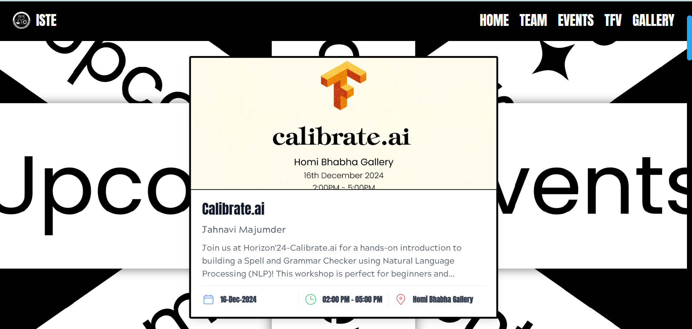
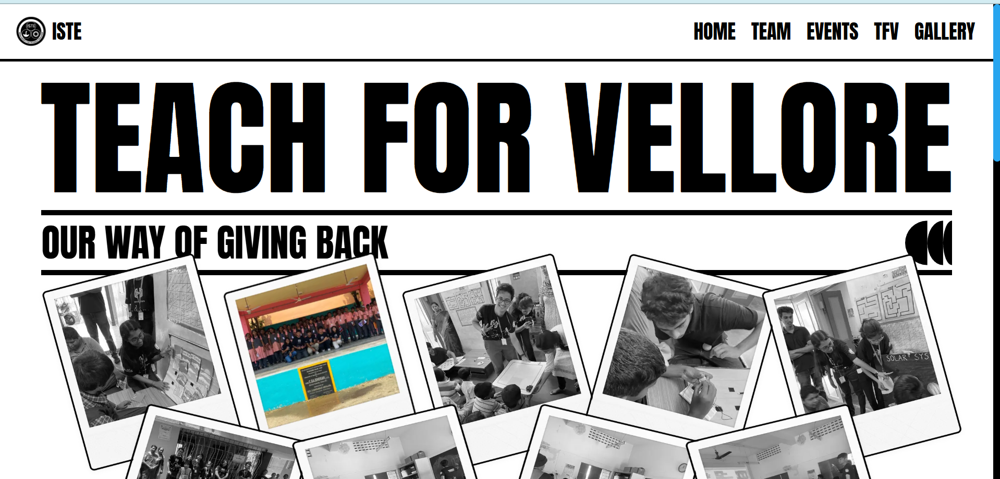

  

<h1 align="center">✨ ISTE-VIT Official Website 2024 ✨</h1>

  
  
  
  
  

  <b>The cutting-edge digital presence of ISTE-VIT, reimagined for 2024</b>

🚀 Technology Stack
Our website leverages modern web technologies to deliver a seamless user experience:

<table align="center">
  <tr>
    <td align="center"> <b>Next.js</b> <i>React framework</i></td>
    <td align="center"> <b>Tailwind CSS</b> <i>Utility-first CSS</i></td>
    <td align="center"> <b>Node.js</b> <i>JavaScript runtime</i></td>
  </tr>
  <tr>
    <td align="center"> <b>Express.js</b> <i>Web framework</i></td>
    <td align="center"> <b>MongoDB</b> <i>NoSQL database</i></td>
  </tr>
</table>

🖼️ Visual Showcase
User Interface

<table>
  <tr>
    <td colspan="2"><h3 align="center">Homepage Experience</h3></td>
  </tr>
  <tr>
    <td width="50%">
<i>Immersive Landing Animation</i>
</td>
    <td width="50%">
<i>Elegant Landing Page</i>
</td>
  </tr>
</table>
<table>
  <tr>
    <td colspan="3"><h3 align="center">Core Features</h3></td>
  </tr>
  <tr>
    <td width="33%">
<i>Webinar Platform</i>
</td>
    <td width="33%">
<i>Interactive Gallery</i>
</td>
    <td width="33%">
<i>Upcoming Events</i>
</td>
  </tr>
</table>
<table>
  <tr>
    <td colspan="3"><h3 align="center">Key Sections</h3></td>
  </tr>
  <tr>
    <td width="33%">
<i>Events Showcase</i>
</td>
    <td width="33%">
<i>Tech for Vellore Initiative</i>
</td>
    <td width="33%">
<i>Our Team</i>
</td>
  </tr>
</table>
Administrative Dashboard
<table>
  <tr>
    <td colspan="3"><h3 align="center">Admin Control Center</h3></td>
  </tr>
  <tr>
    <td width="33%">
<i>Admin Interface</i>
</td>
    <td width="33%">
<i>Analytics Dashboard</i>
</td>
    <td width="33%">
<i>Role Management</i>
</td>
  </tr>
</table>

👥 Contributors

<h3 align="center">The Minds Behind This Project</h3>
<table align="center">
  <tr>
    <td align="center"><h4>🧑‍💻 Development Team</h4></td>
    <td align="center"><h4>🎨 Design Team</h4></td>
  </tr>
  <tr>
    <td align="center">
      <a href="https://github.com/Harsh-1-0"> <b>Harsh Kumar Sinha</b></a>
    </td>
    <td align="center">
      <a href="https://bento.me/gaganb"> <b>Gagan N Bangaragiri</b></a>
    </td>
  </tr>
  <tr>
    <td align="center">
      <a href="https://github.com/shankar-b-s"> <b>Shankar B S</b></a>
    </td>
    <td align="center">
      <a href="https://github.com/cjaradhye"> <b>Aradhye Swarup</b></a>
    </td>
  </tr>
</table>

  <a href="http://istevit.in/devs"><b>Meet The Contributors →</b></a>

🚀 Quick Setup Guide
bash# Clone the repository
git clone https://github.com/Harsh-1-0/ISTE_Website_Fontend

# Navigate to project directory

cd ISTE_Website_Fontend

# Install dependencies

npm install

# Start development server

npm run dev

  <i>Server will be running at <code>http://localhost:3000</code></i>

💻 Key Features

Responsive Design: Seamless experience across all devices
Dynamic Content Management: Easy content updates through admin panel
Interactive Elements: Engaging user interactions and animations
Performance Optimized: Fast loading times and optimized assets
Secure Authentication: Role-based access control

  
  
  

  

<h3 align="center">Made With  by <a href="https://istevit.in/">ISTE-VIT</a> </h3>
